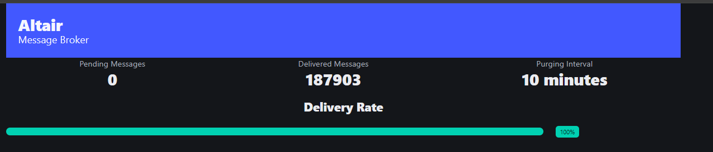

# Altair

A distributed asynchronous messaging platform developed in Go. Made only for study purposes.

## 🚀 About the Project

Altair is an asynchronous messaging system that allows sending and receiving messages through topics, with disk persistence and delivery via HTTP push consumers. Inspired by Apache Kafka, but with a simpler and more focused implementation.

## 🛠️ Technologies

- **Go** - Main language (strong in concurrency and performance)
- **Htmx** - Simple Dashboard
- **Append-only Log** - Data persistence
- **Distributed System** - Scalable architecture
- **HTTP Push** - Consumer delivery strategy

## 📋 Features

- 🔄 Message reception in topics
- 🔄 Disk persistence (append-only log)
- 🔄 HTTP push delivery to consumers
- 🔄 Partitioning
- 🔄 Replication and persistence
- 🔄 Offset tracking per consumer
- 🔄 HTTP push delivery
- 🔄 Backpressure

## 🏗️ Architecture

```
┌─────────────┐    ┌─────────────┐    ┌─────────────┐
│   Producer  │───▶│   Altair    │───▶│  Consumer   │
│             │    │   Broker    │    │   (HTTP)    │
└─────────────┘    └─────────────┘    └─────────────┘
                          │
                          ▼
                   ┌─────────────┐
                   │ Append-only │
                   │     Log     │
                   └─────────────┘
```

## 🚀 How to Run

```bash
# Run the project
make run

# Or directly with Go
go run ./main.go
```

## Accessing the Dashboard

Access the following Url:

`http://localhost:8080/`

### Dashboard Features

- Pending messages to be delivered
- Delivered Messages
- Current Purge interval
- Progress bar of delivered messages



## Performance Test

Running 30s test @ http://localhost:8080/publish
20 connections with 20 pipelining factor

⏱️ Latency
<table> <tr><th>Stat</th><th>2.5%</th><th>50%</th><th>97.5%</th><th>99%</th><th>Avg</th><th>Stdev</th><th>Max</th></tr> <tr><td><b>Latency</b></td><td>19 ms</td><td>28 ms</td><td>100 ms</td><td>105 ms</td><td><b>38.25 ms</b></td><td>40.9 ms</td><td>1134 ms</td></tr> </table>

📈 Throughput
<table> <tr><th>Stat</th><th>1%</th><th>2.5%</th><th>50%</th><th>97.5%</th><th>Avg</th><th>Stdev</th><th>Min</th></tr> <tr><td><b>Req/Sec</b></td><td>1,224</td><td>1,224</td><td>13,343</td><td>16,119</td><td><b>10,315.5</b></td><td>5,103.26</td><td>1,224</td></tr> <tr><td><b>Bytes/Sec</b></td><td>474 kB</td><td>474 kB</td><td>5.16 MB</td><td>6.24 MB</td><td><b>3.99 MB</b></td><td>1.97 MB</td><td>474 kB</td></tr> </table>

Req/Bytes counts sampled once per second.
**of samples: 30**

310k requests in 30.04s, 120 MB read. Ryzen 5600x + RTX 3060

Transaction time, with 5s delay in consumer: 1m07s to process all messages.

## 🎯 Technical Challenges

### Partitioning

- Message distribution across multiple partitions
- Load balancing
- Message ordering by key

### Replication and Persistence

- Synchronization between replicas
- Data durability
- Failure recovery

### Offset Tracking

- Consumer read position control
- Offset persistence
- State recovery

### HTTP Push Delivery

- HTTP POST delivery to consumer endpoints
- Retry mechanisms for failed deliveries
- Consumer acknowledgment handling

### Backpressure

- Data flow control
- Overload prevention
- Throttling mechanisms

## 📁 Project Structure

---

**Altair** - Simplified Asynchronous Messaging 🚀
